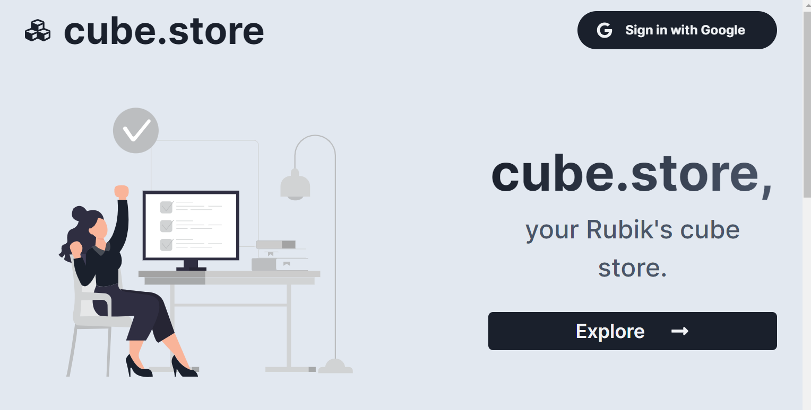

# cube.store

cube.store is a Rubik's cube e-commerce developed with ReactJS and Next.js
 

## 💻 Project

The project is a Rubik's cube e-commerce.

Why Rubik's cube? Another thing that I like to do besides programming is competitive speedcubing, so I thought it would be a good idea to a programming project.

The application consumes the Stripe API to get the products and uses Next.js API Routes to deal with the product checkout. Also, it uses Next Auth to deal with social authentication with Google.

The Stripe API data is consumed using getStaticProps function, which makes dynamic data to be static.

Chakra UI was used to develop the UI.

**Knowledge**  
When developing this project I expanded and improved my knowledge in:

- Static site generation;
- Social authentication;
- API Routes;
- Declarative UI (Chakra UI);
- Component separation;
- Responsiveness

## ⚒️ Features

- Authentication with Google using Next Auth;
- Static site generation;
- Payments with Stripe;
- Filter cubes by event (2x2x2, 3x3x3 etc...);
- Breadcrumbs navigation;
- Not let the user make a purchase if not authenticated

## 💙 Technologies

#### 🚀 ReactJS

#### 🚀 React Hooks

#### 🚀 Next.js

#### 🚀 Next Auth

#### 🚀 TypeScript

#### 🚀 Chakra UI

#### 🚀 Stripe

#### 🚀 Axios
